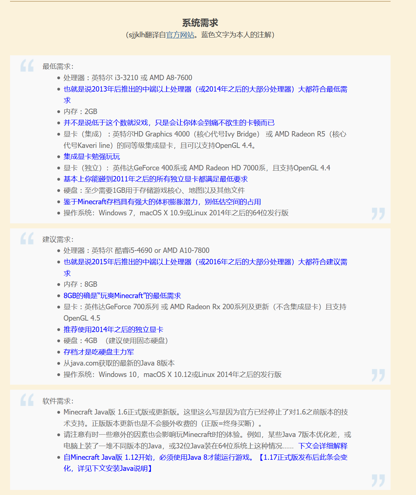

# 前置知识
1. Minecraft常见的版本有Java版与基岩版两种，我们联机使用Java版本（一直玩的Java版，懒得研究基岩版了。而且Java版可以玩盗版）
1. Java版有若干版本号，我们联机玩小游戏是使用1.8版本。有较多mod的版本为1.7.10和1.12.2，进行模组生存的时候可能会使用这两个版本
1. Minecraft可以通过安装多种mod来丰富游戏体验，不过没有mod的纯净版本也可以玩
1. 更多知识请参阅[我的世界Minecraft Java版 下载指南|文件结构说明|推荐启动器](https://www.mcbbs.net/thread-38297-1-1.html)

# 系统需求
下图来自[我的世界Minecraft Java版 下载指南|文件结构说明|推荐启动器](https://www.mcbbs.net/thread-38297-1-1.html)。其实只要不是非常古老的电脑应该都行。

# 准备工作
## 安装纯净的1.8版本
1. 下载并安装Java
    在[此处](https://www.java.com/zh-CN/download/)下载Java安装包并安装
1. 下载启动器
    下面以HMCL启动器为例，也可以选择自己喜欢的启动器
    在[这个链接](https://ci.huangyuhui.net/job/HMCL/)下载，选择第一个exe文件进行下载，放到一个单独的文件夹中
1. 打开启动器，新建账户
    - 登录方式：离线模式（其实就是盗版）
    - 用户名：随便填，支持中文（但最好别带中文）
1. 下载并安装游戏本体
    1. 点击左侧的游戏列表
    1. 选择上方“全局游戏设置”-第二项“运行路径”，选择“各版本独立”
    1. 点击左上角返回后，选择上方“安装新游戏版本”
    1. 找到自己需要的版本号，即1.8
    1. 名称随便起一个，自己能认出来就行。底下的全都不要管
        如果下载卡住，在选择版本的页面右上角更换一个下载源
        
1. 点击左上角返回主菜单，点击右下角启动游戏。如果“启动游戏”下的游戏名称与你刚刚设置的不同，点击红框框出的箭头，选择正确的游戏版本。
    
1. 等待游戏启动。可能要下载一些东西，需耐心等待一段时间
1. （可选）自己安装想要的mod
## 安装可以使用mod的版本
先学会如何安装纯净版
1. 仿照安装纯净版的过程，进行到下图所示步骤
1. 若无特殊需求，```Fabric版本```选择不安装，```Forge版本```可以无脑选最新，```LiteLoader版本```选择不安装，```OptiFine版本```也可以无脑选最新
## 安装整合包
下面的教程以我提供的整合包为例。
1. 下载整合包
1. 打开启动器-游戏列表-安装整合包-导入本地整合包文件
1. 起名字
1. 安装

# 如何联机
联机的途径有两种。一种是连接到服务器，一种是将地图对局域网开放进行联机。我们主要用前一种方式。
**注意**：下面操作过程中如果出现防火墙提示，请点击“允许访问”
## 连接到服务器
首先测试一下自己的网络是否支持ipv6，如果可以，则推荐使用ipv6地址连接服务器，应该会比ipv4地址更好一些；如果不行，则只能使用ipv4地址进行连接。
测试网址：[test-ipv6.com/index.html.zh_CN](test-ipv6.com/index.html.zh_CN)
如果结果是10/10，则支持ipv6
### 使用ipv4地址连接
#### 方法一
1. 选择“多人模式”
1. 选择“直接连接”
1. 输入服务器地址，并选择“加入服务器”
#### 方法二（推荐）
1. 选择“多人模式”
1. 选择“添加服务器”
1. “服务器名称”随意。输入服务器地址```cn2.frp.cool:13469```

### 使用ipv6地址连接
同使用ipv4地址连接，但要将服务器地址改为```[]```（注意不要丢掉中括号）
## 局域网联机
1. 使用[游侠对战平台](http://pk.ali213.net)，进入相同线路
1. 其余操作同“使用ipv4地址连接”
