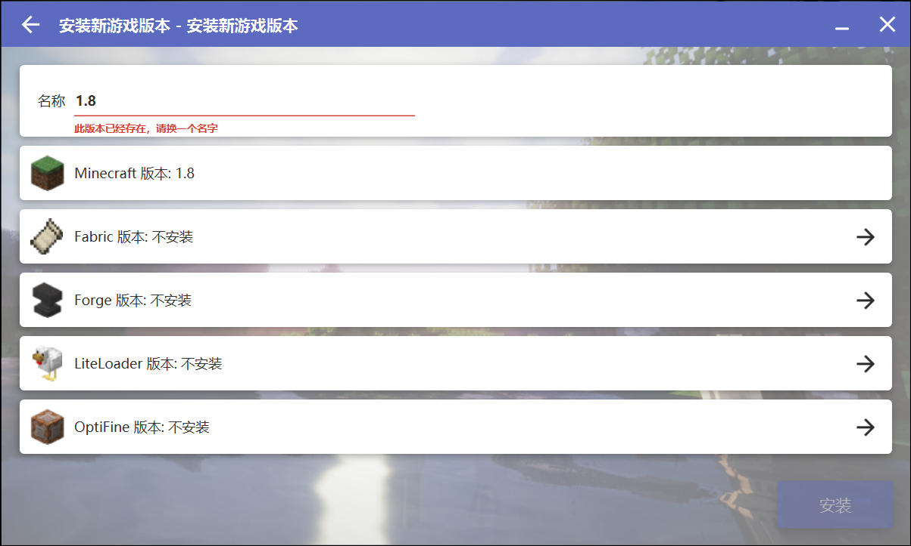
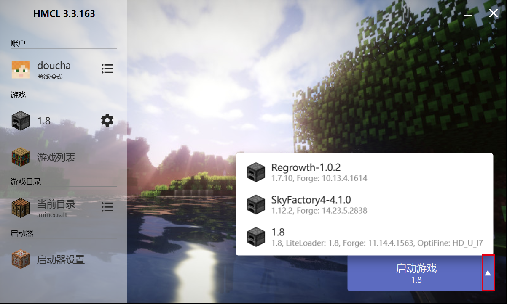

# 前置知识
1. Minecraft常见的版本有Java版与基岩版两种，我们联机使用Java版本（一直玩的Java版，懒得研究基岩版了）
1. Java版有若干版本号，我们联机是使用1.8版本（常用）或1.7.10版本（不常用）
1. Minecraft可以通过安装多种mod来丰富游戏体验，不过没有mod的纯净版本也可以玩
1. 更多知识请参阅[我的世界Minecraft Java版 下载指南|文件结构说明|推荐启动器](https://www.mcbbs.net/thread-38297-1-1.html)

# 准备工作
## 安装纯净的1.8版本
1. 下载并安装Java
    在[此处](https://www.java.com/zh-CN/download/)下载Java安装包并安装
1. 下载启动器
    下面以HMCL启动器为例，也可以选择自己喜欢的启动器
    两种下载途径
    - [github](https://github.com/huanghongxun/HMCL/releases/tag/v3.3.163)（鉴于github在中国并不是很稳定，建议选择下面的途径）
    - 用FileZilla从我的文件服务器下载
1. 打开启动器，新建账户
    - 登录方式：离线模式（其实就是盗版）
    - 用户名：随便填，支持中文
1. 下载并安装游戏本体
    1. 点击左侧的游戏列表
    1. 选择上方“安装新游戏版本”
    1. 找到自己需要的版本号，即1.8
    1. 名称随便起一个，自己能认出来就行。底下的全都不要管
        
1. 点击左上角返回主菜单，点击右下角启动游戏。如果“启动游戏”下的游戏名称与你刚刚设置的不同，点击红框框出的箭头，选择正确的游戏版本。
    
1. 等待游戏启动。可能要下载一些东西，需耐心等待一段时间
1. （可选）自己安装想要的mod
## 安装整合包
下面的教程以用FileZilla在我的文件服务器上下载的整合包为例。
1. 下载整合包
1. 打开启动器-游戏列表-安装整合包-导入本地整合包文件
1. 起名字
1. 安装

# 如何联机
联机的途径有两种。一种是连接到服务器，一种是将地图对局域网开放进行联机。我们主要用前一种方式。
**注意：**下面操作过程中如果出现防火墙提示，请点击“允许访问”
## 连接到服务器
### 使用ipv4地址连接
1. 选择“多人模式”
1. 选择“直接连接”
1. 输入服务器地址，并选择“加入服务器”

### 使用ipv6地址连接
1. 选择“多人模式”
1. 选择“添加服务器”
1. “服务器名称”随意。输入服务器地址
1. 选择“完成”
1. 双击新建的服务器
   注：同ipv4的操作也可以
## 局域网联机
1. 使用[游侠对战平台](pk.ali213.net)，进入相同线路
1. 其余操作同“使用ipv4地址连接”